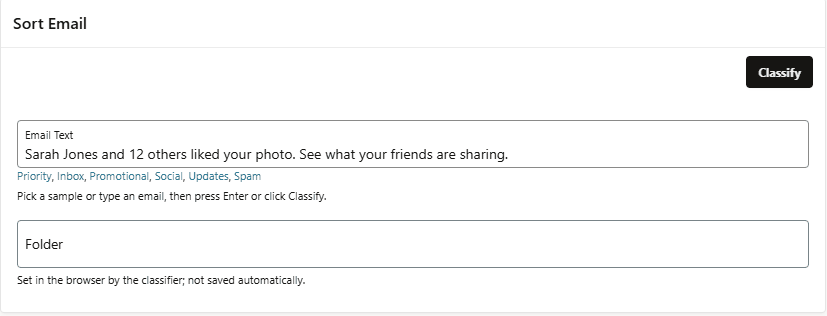

# Zero-shot classification

An Oracle APEX Dynamic Action plug-in that classifies the text of a page item **in the browser** using [Transformers.js](https://huggingface.co/docs/transformers.js) zero-shot classification, then writes the value of the winning category to another page item.

- No server-side AI service, API keys or database ML required
- Uses WebGPU when available, with an automatic fallback to WASM
- You define the categories as a simple JSON array
- The result is set on the client only; the page is not submitted

## Preview Image



## How it works

1. When the Dynamic Action fires, the plug-in reads the text from the **Input Item**
2. On first use, Transformers.js is loaded from the jsDelivr CDN and the model is downloaded from Hugging Face (both are cached by the browser for later use)
3. The text is classified against every **candidate** in **Categories**
4. The **value** of the highest scoring candidate is written to the **Output Item**

| Component | Detail                                                                                  |
|-----------|-----------------------------------------------------------------------------------------|
| Library   | `@huggingface/transformers` 4.3.0 (Apache-2.0), loaded from `cdn.jsdelivr.net`          |
| Model     | [`Xenova/nli-deberta-v3-xsmall`](https://huggingface.co/Xenova/nli-deberta-v3-xsmall), downloaded from `huggingface.co` |
| Backend   | WebGPU (`fp16` if the adapter supports `shader-f16`, otherwise `fp32`), falling back to WASM (`q8`) |

## Settings

| Name         | Value                                                                                                          |
|--------------|----------------------------------------------------------------------------------------------------------------|
| Input Item   | The page item containing the text to classify                                                                  |
| Output Item  | The page item that receives the "value" of the winning category                                                |
| Categories   | A JSON array of objects. Each object has a "candidate" (the text passed to the classifier) and a "value" (written to the Output Item when that candidate wins). Candidates must be unique |
| Show Overlay | Show the APEX wait overlay while the model loads and classifies the text. Default **Yes**                      |

The standard **Wait for Result** and **Stop Execution on Error** Dynamic Action attributes are also supported, so any following actions run only once the Output Item has been set.

## Categories (JSON Array) Usage

The default value is

```
[
  {"candidate": "positive", "value": "Positive"},
  {"candidate": "negative", "value": "Negative"},
  {"candidate": "neutral",  "value": "Neutral"}
]
```

i.e. the **candidate** is the label the model scores the text against, and the **value** is what gets written to the Output Item when that candidate wins. The value can be a string or a number, so it can match a Select List or Radio Group return value.

Descriptive candidates often classify better than single words. For example:

```
[
  {"candidate": "a positive review", "value": "Positive"},
  {"candidate": "a negative review", "value": "Negative"},
  {"candidate": "a neutral review",  "value": "Neutral"}
]
```

 You are welcome to use any of the below Demonstration sets:

### Demonstration sets

<details>
  <summary>Support Ticket Routing</summary>

  ```
  [
    {"candidate": "a billing or payment question",   "value": "BILLING"},
    {"candidate": "a technical problem or bug",      "value": "TECH"},
    {"candidate": "a request for a new feature",     "value": "FEATURE"},
    {"candidate": "a question about my account",     "value": "ACCOUNT"}
  ]
  ```
</details>

<details>
  <summary>Priority</summary>

  ```
  [
    {"candidate": "urgent",     "value": 1},
    {"candidate": "important",  "value": 2},
    {"candidate": "not urgent", "value": 3}
  ]
  ```
</details>

<details>
  <summary>RAG Status</summary>

  ```
  [
    {"candidate": "on track",  "value": "G"},
    {"candidate": "at risk",   "value": "A"},
    {"candidate": "off track", "value": "R"}
  ]
  ```
</details>

## Installation
1. Download the plug-in file from the `plug-in` folder or the latest release
2. Import the plug-in file into your application

## Usage

1. Create a page item for the text, e.g. **P1_TEXT** (Textarea)
2. Create a page item for the result, e.g. **P1_CATEGORY** (Text Field, Select List, Radio Group...)
3. Create a Dynamic Action, e.g. on click of a button or on change of **P1_TEXT**
4. Add a True Action of type **Zero-shot classification**
5. Set **Input Item** to **P1_TEXT**, **Output Item** to **P1_CATEGORY** and adjust **Categories** as required

## Behaviour

- If the Input Item is empty, nothing is classified and the Output Item is left unchanged
- Invalid Categories JSON (not an array, empty, missing "candidate"/"value", duplicate candidates) is reported as a page error
- If WebGPU fails to initialise or fails during inference, the plug-in retries once on WASM
- The classifier is created once per page and reused for subsequent runs
- The winning candidate, its score, the value and the backend used are logged to the browser console with the prefix `[Zero-shot classification]`

## Tips

1. The first run is the slowest as the model must be downloaded. Keep **Show Overlay** on so users know something is happening.
2. Users need internet access to `cdn.jsdelivr.net` and `huggingface.co`, so check any Content Security Policy or proxy rules.
3. Use a Chromium based browser with WebGPU for the fastest results; other browsers will use the WASM backend.
4. Experiment with the wording of the candidates. Zero-shot models respond well to short, descriptive phrases.

## Demo Application
There is no hosted demo application. See the [GitHub repository](https://github.com/lufcmattylad/Zero-shot-classification-apex-plugin) for the plug-in and preview.

## Version History

### 26.1.0 (Sep 2026)
- Initial Release

## Donations

Donations to [Saint Michael's Hospice](https://saintmichaelshospice.org/support-our-work/donate/one-off-donation/) are welcome
